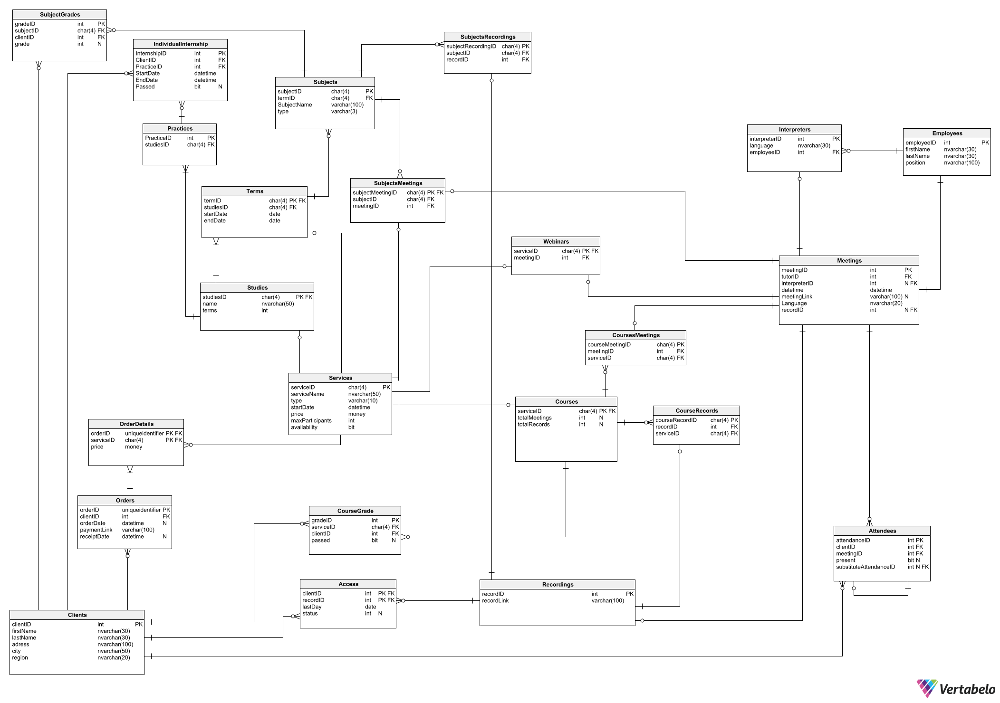

**<font  size=6>Projekt bazy danych  firmy edukacyjnej</font>**

Przedmiot: Podstawy Baz Danych
Autorzy: Maciej Nowakowski, Zuzanna Stajniak, Mateusz Lampert


**<font  size=4>Użytkownicy bazy danych:</font>**
1. Administrator
2. Dyrektor Placówki
3. Pracownik biura administracji
4. Pracownik biura dydaktyki
5. Prowadzący
6. Tłumacz
7. Student


**<font  size=4>Funkcje Użytkowników:</font>**
1. Administrator
	* Usuwanie nagrań
2. Dyrektor placówki
	* Dodawanie pracowników
	*  Indywidualne zmienianie terminów opłat
3. Pracownik biura administracji 
	* Generowanie raportów
	* Układanie planu zajęć 
	* Zmiana harmonogramu zajęć z przyczyn losowych
4. Pracownik biura dydaktyki
	* Generowanie raportów
	* Generowanie i wysyłanie dyplomu
	* Weryfikowanie czy użytkownik zaliczył dany kurs lub studia 
5. Prowadzący
	* Tworzenie sylabusa nowego przedmiotu 
	* Tworzenie webinarów
	* Zakładanie kursów
	* Sprawdzanie obecności na stacjonarnych zajęciach 
	* Weryfikacja odrabiania nieobecności na studiach. 
6. Tłumacz
7. Student 
	* Dodawanie usług do koszyka
	*  Opłacanie usług w koszyku 
	*  Zapis na zajęcia do odrabiania nieobecności na studiach

8. Każdy użytkownik
	* Możliwość przeglądania oferty kursów


**<font  size=4>Funkcje Systemowe:</font>**
* Sprawdzanie obecności zdalnej
* Sprawdzanie czy użytkownik ma dostęp do usługi
* Sprawdzenie czy zapis na daną usługę jest możliwy.


**<font  size=4>Schemat bazy danych</font>**


**<font  size=4>Opis tabel</font>**

**Clients**

Tabela przechowuje podstawowe dane o kliencie. Zawiera identyfikator klienta
(clientID), imię oraz nazwisko (firstName, lastName) oraz dane adresowe (adress, city, region).

Klucz główny: clientID

**Orders**

Tabela przechowuje podstawowe dane o zamówieniu. Zawiera identyfikator zamówienia
(orderID), indentyfikator klienta (clientID), datę zamówienia (orderDate), link do płatności (paymentLink) oraz datę przyjęcia płatności (receiptDate).

Klucz główny: orderID
Klucz obcy: clientID (z tabelą clients)

**OrderDetails**

Tabela przechowuje szczegółowe dane o zamówieniu. Zawiera identyfikator zamówienia
(orderID),identyfikator usługi w koszyku (serviceID) oraz cenę za tą usługę (price).

Klucze główne: orderID, serviceID
Klucze obce: orderID (z tabelą **Orders**), serviceID (z tabelą **Services**)

**Services**

Tabela przechowuje podstawowe dane o dostępnych usługach edukacyjnych. Zawiera identyfikator usługi (serviceID), nazwę usługi (serviceName), typ usługi (type - webinar, kurs, studia, zjazd, pojedyńcze zajęcia), datę rozpoczęcia (startDate) oraz cenę(price).

Klucz główny: serviceID

**Studies**

Tabela przechowuje podstawowe dane o studiach. Zawiera identyfikator studiów(serviceID), nazwę (name), liczbę lat studiów (years) oraz liczbę zjazdów (terms).

Klucz główny: ServiceID
Klucz obcy: ServiceID (z tabelą **Services**)

**Terms**

Tabela przechowuje podstawowe dane o zjezdzie na studiach. Zawiera identyfikator zjazdu(termID), identyfikator studiów(serviceID), datę rozpoczęcia i zakończenia(startDate, endDate).

Klucz główny: termID
Klucz obcy: serviceID (z tabelą **Studies**)

**Sylabus**

Tabela przechowuje szczegółowe dane o sylabusie zjazdu na studiach. Zawiera identyfikator sylabusa (SylabusID) oraz identyfikator zjazdu (termID)

Klucz główny: sylabusID
Klucz obcy: termID (z tabelą **Terms**)

**Subjects**

Tabela zawiera szczegółowe informacje o przedmiotach realizowanych podczas poszczególnych zjazdów. Zawiera identyfikator przedmiotu(subjectID), identyfikator sylabusa (sylabusID), nazwę przedmiotu (subjectName) 

Klucz główny: subjectID
Klucz obcy: sylabusID (z tabelą **Sylabus**)

**Grades**

Tabela przechowuje informację o zaliczeniu przedmiotu. Zawiera identyfikator oceny(gradeID), identyfikator przedmiotu (subjectID), identyfikator klienta (clientID) oraz informację o zaliczeniu przedmiotu

Klucz główny: gradeID
Klucze obce: subjectID (z tabelą **Subjects**)

**Employees**

Tabela przechowuje podstawowe dane o pracownikach. Zawiera identyfikator pracownika
(employeeID), imię oraz nazwisko (firstName, lastName) oraz stanowisko (position).

Klucz główny:  employeeID

**Interpreters**

Tabela przechowuje podstawowe dane o tłumaczu. Zawiera identyfikator tłumacza (interpreterID), identyfikator pracownika (employeeID) oraz język, którym się posługuje (language)

Klucz główny: interpreterID
Klucz obcy:  employeeID (z tabelą **Employees**)

**ServiceDetails**

Tabela przechowuje szczegółowe dane o danej usłudze. Zawiera identyfikator usługi (courseID), identyfikator prowadzącego przedmiot(tutorID), maksymalną liczbę uczestników (maxParticipants), liczbę spotkań (totalMeetings) oraz liczbę nagrań do obejrzenia (totalRecords).

Klucz główny: serviceID
Klucze obce:  serviceID (z tabelami **Services**), tutorID (z tabelą **Employees**)

**Meetings**

Tabela przechowuje dane o spotkaniu. Zawiera identyfikator spotkania (meetingID), identyfikator usługi (serviceID), identyfikator tłumacza (interpreterID), datę i czas spotkania (datetime), link do spotkania online (meetingLink) oraz język, w którym prowadzone jest spotkanie.

Klucz główny: meetingID
Klucze obce:  serviceID (z tabelą **ServiceDetails**), interpreterID (z tabelą **Interpreters**)

**Attendees**

Tabela przechowuje dane o uczestnikach spotkań. Zawiera identyfikator uczestnika (attendeeID),  identyfikator spotkania (meetingID), identyfikator usługi (serviceID), informację o obecności (present) oraz indentyfikator zajęć na których odrabiano nieobecność (substituteMeetingID).

Klucze główne: attendeeID, meetingID
Klucz obcy: attendeeID (z tabelą **Attendees**), meetingID (z tabelami **Attendees**, **Meetings**)

**Recordings**

Tabela przechowuje linki do nagrań. Zawiera identyfikator spotkania (meetingID) oraz link do nagrania (recordLInk).

Klucz główny: meetingID
Klucz obcy: meetingID (z tabelą **Meetings**)

**Access**

Tabela przechowuje dane dostępów do nagrań. Zawiera identyfikator klienta (clientID),  identyfikator spotkania (meetingID), datę końca dostępu (lastDay) oraz status obejrzenia (status).

Klucz główny: clientID
Klucz obcy: meetingID (z tabelą **Recordings**)

<div style="page-break-after: always;"></div>

**<font  size=4>Implementacja</font>**

Do utworzenia bazy danych wraz z wszystkimi połączeniami użyta została następująca implementacja:

```sql
	-- tables
	-- Table: Access
	CREATE TABLE Access (
		clientID int  NOT NULL,
		meetingD int  NOT NULL,
		lastDay date  NOT NULL,
		status int  NULL,
		CONSTRAINT Access_pk PRIMARY KEY  (clientID)
	);

	-- Table: Attendees
	CREATE TABLE Attendees (
		attendeeID int  NOT NULL,
		meetingID int  NOT NULL,
		serviceID int  NOT NULL,
		present int  NULL,
		substituteMeetingID int  NULL,
		CONSTRAINT Attendees_pk PRIMARY KEY  (meetingID,attendeeID)
	);

	-- Table: Clients
	CREATE TABLE Clients (
		clientID int  NOT NULL,
		firstName varchar(30)  NOT NULL,
		lastName varchar(30)  NOT NULL,
		adress varchar(100)  NOT NULL,
		city varchar(50)  NOT NULL,
		region varchar(10)  NOT NULL,
		CONSTRAINT Clients_pk PRIMARY KEY  (clientID)
	);

	-- Table: Employees
	CREATE TABLE Employees (
		employeeID int  NOT NULL,
		firstName varchar(30)  NOT NULL,
		lastName varchar(30)  NOT NULL,
		position varchar(100)  NOT NULL,
		CONSTRAINT Employees_pk PRIMARY KEY  (employeeID)
	);

	-- Table: Grades
	CREATE TABLE Grades (
		gradeID int  NOT NULL,
		subjectID char(4)  NOT NULL,
		clientID int  NOT NULL,
		passed int  NULL,
		CONSTRAINT Grades_pk PRIMARY KEY  (gradeID)
	);

	-- Table: IndividualInternship
	CREATE TABLE IndividualInternship (
		InternshipID int  NOT NULL,
		ClientID int  NOT NULL,
		PracticeID int  NOT NULL,
		StartDate datetime  NOT NULL,
		EndDate datetime  NOT NULL,
		Passed int  NOT NULL,
		CONSTRAINT IndividualInternship_pk PRIMARY KEY  (InternshipID)
	);

	-- Table: Interpreters
	CREATE TABLE Interpreters (
		interpreterID int  NOT NULL,
		language varchar(30)  NOT NULL,
		employeeID int  NOT NULL,
		CONSTRAINT Interpreters_pk PRIMARY KEY  (interpreterID)
	);

	-- Table: Meetings
	CREATE TABLE Meetings (
		meetingID int  NOT NULL,
		interpreterID int  NULL,
		serviceID char(4)  NOT NULL,
		datetime datetime  NOT NULL,
		meetingLink varchar(100)  NULL,
		Language varchar(20)  NOT NULL,
		CONSTRAINT Meetings_pk PRIMARY KEY  (meetingID)
	);

	-- Table: OrderDetails
	CREATE TABLE OrderDetails (
		orderID int  NOT NULL,
		serviceID char(4)  NOT NULL,
		price money  NOT NULL,
		CONSTRAINT OrderDetails_pk PRIMARY KEY  (orderID,serviceID)
	);

	-- Table: Orders
	CREATE TABLE Orders (
		orderID int  NOT NULL,
		clientID int  NOT NULL,
		orderDate datetime  NULL,
		paymentLink varchar(100)  NOT NULL,
		receiptDate datetime  NULL,
		CONSTRAINT Orders_pk PRIMARY KEY  (orderID)
	);

	-- Table: Practices
	CREATE TABLE Practices (
		PracticeID int  NOT NULL,
		SylabusID int  NOT NULL,
		CONSTRAINT Practices_pk PRIMARY KEY  (PracticeID)
	);

	-- Table: Recordings
	CREATE TABLE Recordings (
		meetingID int  NOT NULL,
		recordLink varchar(100)  NOT NULL,
		CONSTRAINT Recordings_pk PRIMARY KEY  (meetingID)
	);

	-- Table: ServiceDetails
	CREATE TABLE ServiceDetails (
		serviceID char(4)  NOT NULL,
		tutorID int  NOT NULL,
		maxParticipants int  NULL,
		totalMeetings int  NULL,
		totalRecords int  NULL,
		CONSTRAINT ServiceDetails_pk PRIMARY KEY  (serviceID)
	);

	-- Table: Services
	CREATE TABLE Services (
		serviceID char(4)  NOT NULL,
		serviceName varchar(50)  NOT NULL,
		type varchar(10)  NOT NULL,
		startDate datetime  NOT NULL,
		price money  NOT NULL,
		CONSTRAINT Services_pk PRIMARY KEY  (serviceID)
	);

	-- Table: Studies
	CREATE TABLE Studies (
		serviceID char(4)  NOT NULL,
		name varchar(50)  NOT NULL,
		terms int  NOT NULL,
		CONSTRAINT Studies_pk PRIMARY KEY  (serviceID)
	);

	-- Table: Subjects
	CREATE TABLE Subjects (
		SubjectID char(4)  NOT NULL,
		SylabusID int  NOT NULL,
		SubjectName varchar(100)  NOT NULL,
		type varchar(3)  NOT NULL,
		CONSTRAINT Subjects_pk PRIMARY KEY  (SubjectID)
	);

	-- Table: Sylabus
	CREATE TABLE Sylabus (
		SylabusID int  NOT NULL,
		termID char(4)  NOT NULL,
		CONSTRAINT Sylabus_pk PRIMARY KEY  (SylabusID)
	);

	-- Table: Terms
	CREATE TABLE Terms (
		termID char(4)  NOT NULL,
		serviceID char(4)  NOT NULL,
		startDate date  NOT NULL,
		endDate date  NOT NULL,
		CONSTRAINT Terms_pk PRIMARY KEY  (termID)
	);

	-- foreign keys
	-- Reference: IndividualInternship_Practices (table: IndividualInternship)
	ALTER TABLE IndividualInternship ADD CONSTRAINT IndividualInternship_Practices
		FOREIGN KEY (PracticeID)
		REFERENCES Practices (PracticeID);

	-- Reference: Practices_sylabus (table: Practices)
	ALTER TABLE Practices ADD CONSTRAINT Practices_sylabus
		FOREIGN KEY (SylabusID)
		REFERENCES Sylabus (SylabusID);

	-- Reference: access_recordings (table: Access)
	ALTER TABLE Access ADD CONSTRAINT access_recordings
		FOREIGN KEY (meetingD)
		REFERENCES Recordings (meetingID);

	-- Reference: attendees_attendees (table: Attendees)
	ALTER TABLE Attendees ADD CONSTRAINT attendees_attendees
		FOREIGN KEY (substituteMeetingID,attendeeID)
		REFERENCES Attendees (meetingID,attendeeID);

	-- Reference: attendees_meeting (table: Attendees)
	ALTER TABLE Attendees ADD CONSTRAINT attendees_meeting
		FOREIGN KEY (meetingID)
		REFERENCES Meetings (meetingID);

	-- Reference: conventions_studies (table: Terms)
	ALTER TABLE Terms ADD CONSTRAINT conventions_studies
		FOREIGN KEY (serviceID)
		REFERENCES Studies (serviceID);

	-- Reference: courseDetails_services (table: ServiceDetails)
	ALTER TABLE ServiceDetails ADD CONSTRAINT courseDetails_services
		FOREIGN KEY (serviceID)
		REFERENCES Services (serviceID);

	-- Reference: grades_Course (table: Grades)
	ALTER TABLE Grades ADD CONSTRAINT grades_Course
		FOREIGN KEY (subjectID)
		REFERENCES Subjects (SubjectID);

	-- Reference: interpreters_employees (table: Interpreters)
	ALTER TABLE Interpreters ADD CONSTRAINT interpreters_employees
		FOREIGN KEY (employeeID)
		REFERENCES Employees (employeeID);

	-- Reference: meeting_interpreters (table: Meetings)
	ALTER TABLE Meetings ADD CONSTRAINT meeting_interpreters
		FOREIGN KEY (interpreterID)
		REFERENCES Interpreters (interpreterID);

	-- Reference: meeting_serviceDetails (table: Meetings)
	ALTER TABLE Meetings ADD CONSTRAINT meeting_serviceDetails
		FOREIGN KEY (serviceID)
		REFERENCES ServiceDetails (serviceID);

	-- Reference: orderDetails_orders (table: OrderDetails)
	ALTER TABLE OrderDetails ADD CONSTRAINT orderDetails_orders
		FOREIGN KEY (orderID)
		REFERENCES Orders (orderID);

	-- Reference: orderDetails_services (table: OrderDetails)
	ALTER TABLE OrderDetails ADD CONSTRAINT orderDetails_services
		FOREIGN KEY (serviceID)
		REFERENCES Services (serviceID);

	-- Reference: orders_clients (table: Orders)
	ALTER TABLE Orders ADD CONSTRAINT orders_clients
		FOREIGN KEY (clientID)
		REFERENCES Clients (clientID);

	-- Reference: recordings_meeting (table: Recordings)
	ALTER TABLE Recordings ADD CONSTRAINT recordings_meeting
		FOREIGN KEY (meetingID)
		REFERENCES Meetings (meetingID);

	-- Reference: serviceDetails_employees (table: ServiceDetails)
	ALTER TABLE ServiceDetails ADD CONSTRAINT serviceDetails_employees
		FOREIGN KEY (tutorID)
		REFERENCES Employees (employeeID);

	-- Reference: studies_services (table: Studies)
	ALTER TABLE Studies ADD CONSTRAINT studies_services
		FOREIGN KEY (serviceID)
		REFERENCES Services (serviceID);

	-- Reference: sylabus_Course (table: Subjects)
	ALTER TABLE Subjects ADD CONSTRAINT sylabus_Course
		FOREIGN KEY (SylabusID)
		REFERENCES Sylabus (SylabusID);

	-- Reference: sylabus_conventions (table: Sylabus)
	ALTER TABLE Sylabus ADD CONSTRAINT sylabus_conventions
		FOREIGN KEY (termID)
		REFERENCES Terms (termID);
```